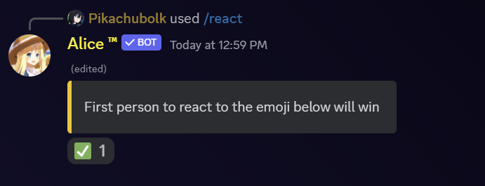

# 🎾 React

> "React" is a game feature of Alice. The bot will send the emoji "✅" below its message. The first one to react to (click) the emoji wins the game.&#x20;

### &#x20;Usage:

```
/react
```

<figure><figcaption><p>Widget Preview</p></figcaption></figure>
